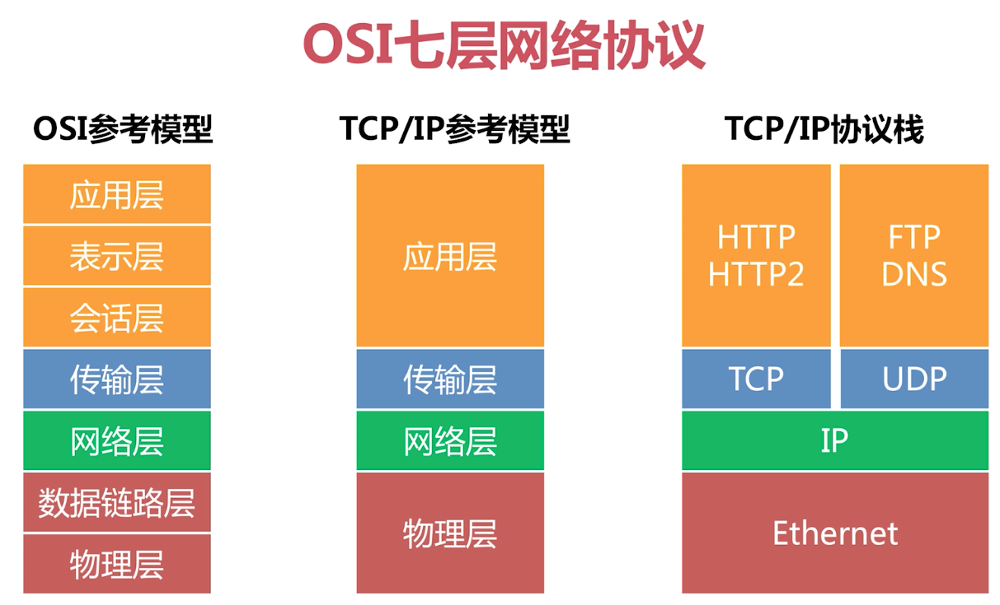
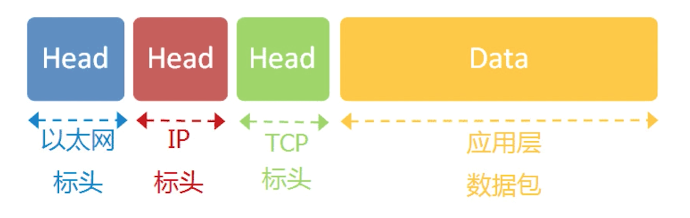
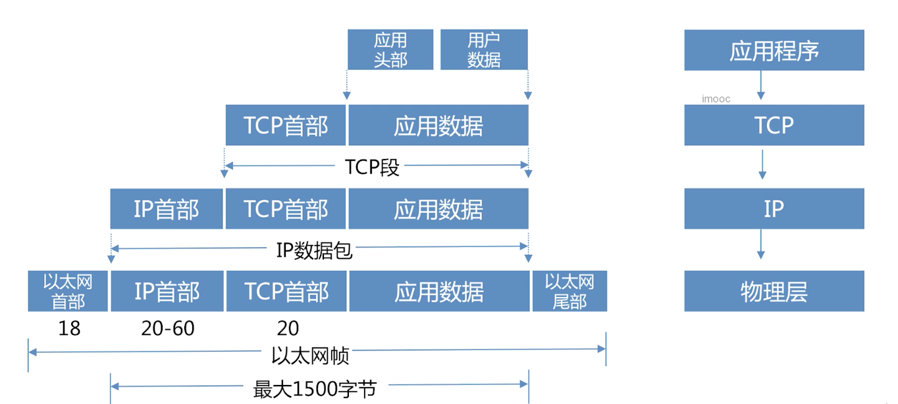

 [**一文详解微服务架构、网关、服务发现注册**](https://www.cnblogs.com/skabyy/p/11396571.html)

### 网关应该具备什么功能

- 支持多种协议代理：tcp、http、websocket、grpc
- 支持多种负载均衡策略：轮询、权重轮询、hash一致性
- 支持下游服务发现：主动探测、自动服务发现
- 支持横向扩容：加机器就能解决高并发

### 借助网关处理高可用、高并发

- 限流：请求 QPS 限制
- 熔断：错误率达到阈值则服务熔断
- 降级：确保核心业务可用
- 权限认证：请求拦截

## 网络基础知识

### osi七层网络协议

### 经典协议与数据包

## 网络代理

### 什么是网络代理

### HTTP代理

### websocket代理

### HTTPS代理

### grpc代理 

## 负载均衡拓展服务发现

